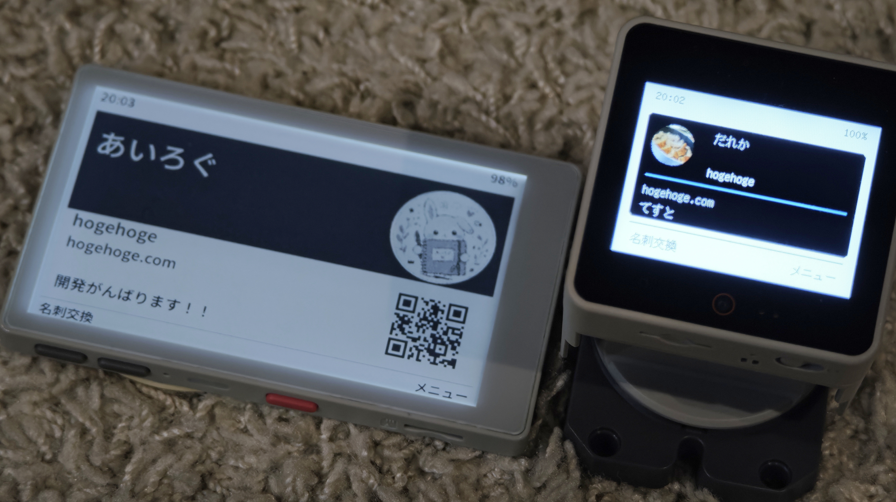

# M5 Touch Card

[日本語](README.md) · [English](README.en.md)

**タッチして、名刺を交換。**

PaperMono C153 / 公式ｽﾀｯｸﾁｬﾝ K151・K151-R向けのオフライン名刺交換ファームウェアと、
Android/iPhone用編集アプリです。



## デモ

### 名刺交換 · 約25秒

端末を近づけて名刺を交換。受け取った相手の名刺が、両方の画面に表示されます。

<!-- BEGIN VIDEO: card-exchange -->

https://github.com/user-attachments/assets/cd2798ff-c891-4521-8a90-304021eb681b

<!-- END VIDEO: card-exchange -->

### スマホから更新 · 約31秒

<!-- BEGIN VIDEO: phone-update -->

https://github.com/user-attachments/assets/b0046ea4-0d4f-4b6d-bd87-edb3436d9dc6

<!-- END VIDEO: phone-update -->

### デザインを選ぶ · 約31秒

<!-- BEGIN VIDEO: card-designs -->

https://github.com/user-attachments/assets/99213d5d-7417-4696-aaa6-da09b605a35e

<!-- END VIDEO: card-designs -->

### 名刺帳を見る · 約17秒

<!-- BEGIN VIDEO: card-book -->

https://github.com/user-attachments/assets/7bbaaae1-e9f9-4768-aa49-6665adaf12c1

<!-- END VIDEO: card-book -->

4本とも実機撮影・ノーカット・等速です。
スマホ更新はiPhone開発版で撮影しています。初回のiPhone向け配布はソースからのビルドのみです。

初回リリースの準備中です。編集・NFC更新・本体表示・機器間交換・名刺帳の閲覧/削除に対応しています。
PaperMono ↔ StackChanの交換は実機確認済み。同一機種ペアやSD故障時の実機検証は未完了です。
ビルド・自動テストと実機確認の範囲は[実装状況](docs/implementation_status.ja.md)に分けて記録しています。

## インストール

[日本語のインストール手順](docs/install.ja.md) · [English installation guide](docs/install.en.md)

通常の `v0.1.0` リリースで、機種別の本体ファームウェアZIPとAndroidの署名済みAPKを配布する方針です。
初回書き込み・更新・最初の名刺設定を上記にまとめています。公開後はGitHubのReleasesから取得してください。
iPhoneは当面ソースからのビルドのみで、IPA・TestFlightは初回に含めません。配布候補の作成・確認は完了し、GitHub公開の準備中です。

## 使える機能

- 名前だけで作れる名刺。アイコン・アカウント・メール・QR用URL・一言は任意。
- 3種類の名刺デザイン。Paper Monoは縦・横の両方、StackChanは専用横レイアウト。アイコンは丸型。
  左上に時刻、右上に電池。小画面ではQRと長い連絡先を詳細画面で表示。
- ホームは「名刺」「画像＋大きい日時＋週間カレンダー」「全画面写真」から選択。
  月間カレンダーも表示。歩数は扱いません。
- 名刺アイコン・日時用画像・全画面画像は独立した保存先。未設定時だけ共通の初期画像。
- スマホから名刺全体・本文だけ・アイコンだけ・各画像・日時をNFC更新。
  本体は「スマホから更新」を1回開くだけで用途を判別します。
- 本体間は「交換」「渡す」「受け取る」。交換では先に渡す側を選び、役割を自動で交代します。
  受信完了後は相手の名刺を表示。交換用アイコンは160pxに軽量化でき、元画像は保持します。
- 名刺帳の名前順 / 最新受信順、ページ送り、詳細・QR、個別削除と確認。
  同一プロフィールIDは統合し、古い世代や同世代の異なる内容を無断上書きしません。
- 本体のみでも使用可能。受信名刺は自動（SD優先）/本体を選択。
  本体・SDそれぞれの使用量、空き、名刺用空き、件数、アプリファイル量を表示。
- 件数固定の保存上限や古い名刺の自動削除はありません。実容量と予約領域で判定。
- 2世代保存、チェックサム検証、索引再構築、削除中断の復旧、SD識別・安全な取り外し。
  スマホ側も2世代保存。送信待ちは内容とIDを保持して再試行できます。
- 日本語 / Englishを本体の設定・スマホの地球メニューから変更。名刺本文・画像・通信形式は変更しません。
- PaperMonoの電源短押しリセット・ダブルクリック電源オフを無効化。Bボタンはライト切り替え。
  消灯中はタッチ・A操作をロックし、下部の操作表示を隠します。Bで再点灯すると操作表示だけを部分更新。
  消灯中も時刻・電池は通常毎分部分更新し、毎時00分だけ残像消去用の全画面更新を1回行います（NFC中は保留）。
  日付・カレンダーの更新は再点灯後に反映します。時計未設定・全画面写真は毎時更新の対象外です。
  通信・保存・描画・名刺帳走査がない消灯中はライトスリープし、毎分の更新かBボタンで復帰します。
  StackChanは電源短押しで画面だけオン・オフ。消灯中もNFCと保存処理を継続します。

## 最初の操作

1. 本体の「メニュー → 設定 → スマホから更新」を開く。
2. アプリの「名刺」で名前などを保存し、「NFCで名刺を更新」を選び、タッチする。
3. 画像はアプリの「画像」で用途・機種を選び、切り抜いてNFC送信する。
4. 時計はアプリ上部の時計ボタン。本体側の待機画面は同じです。
5. 両本体の「名刺交換 → 交換」で、片方を「先に渡す」、もう片方を「先に受け取る」。
   片方向なら「渡す」「受け取る」を使用します。

本体の言語は「設定 → その他 → 言語 / Language」、スマホは上部の地球アイコンから選択。
本体の電源オフ・再起動は「設定 → その他 → 電源」の確認画面から実行します。

細かい導線・初回の本体データ領域初期化・SD操作は[操作ガイド](docs/operation.ja.md)を参照。

## ビルド・検査

検証環境: PlatformIO Core 6.1.19、Flutter 3.32.8 / Dart 3.8.1、CMake、Node.js。
ファームウェアはWindows/macOS/Linux、iOSビルドはmacOSとXcodeが必要です。
AndroidビルドにはJDK 17、Android SDK 36とNDK 27.0.12077973を用意してください。
環境・依存の更新はこの公開整理とは分け、まず固定済みのバージョンを使用します。

```sh
pio run -d firmware -e paper-mono -e stackchan
cmake -S . -B build/native-tests
cmake --build build/native-tests
ctest --test-dir build/native-tests --output-on-failure
node scripts/check_native_protocol.mjs
```

指定なしの初期言語は日本語です。英語で初期起動するビルドは次の環境を選びます。

```sh
pio run -d firmware -e paper-mono-en -e stackchan-en
```

保存済みの言語設定がある場合は、その選択を優先します。再フラッシュだけで言語設定を消去しません。
独自環境では `TOUCH_CARD_DEFAULT_LANGUAGE=0`（日本語）/ `1`（英語）を指定できます。

CMakeはPlatformIOが取得したArduinoJsonを使います。別の場所の場合は
`-DARDUINOJSON_DIR=/path/to/ArduinoJson/src`を指定。
共通ベクトル検査にはNode.js、Kotlin/JDK、Swiftが必要です。C++の検査はmacOS/LinuxのClang/GCC向けです。

`mobile/`:

```sh
flutter pub get --enforce-lockfile
flutter analyze
flutter test
flutter build apk --debug
flutter build ios --simulator --no-codesign
```

スマホの初期言語も日本語。英語はビルドに `--dart-define=TOUCH_CARD_DEFAULT_LANGUAGE=en` を追加。
地球アイコンのメニューから日本語 / Englishを切り替えます。旧版で「スマホの設定に合わせる」を選んでいた場合は日本語になります。

ビルドは書き込み・インストールではありません。既存端末へのフラッシュ、パーティション変更、
初期化前には対象端末とバックアップを確認してください。ストア配布・GitHub公開は未実施。
既存v1ファームウェアとは通信互換ではなく、両端をM5 Touch Cardにする必要があります。

## 資料

- [開発・不具合報告](CONTRIBUTING.md) / [セキュリティと個人情報](SECURITY.md)
- [実装状況・検証結果](docs/implementation_status.ja.md)
- [操作ガイド](docs/operation.ja.md)
- [GitHub公開前チェック](docs/publishing.md)
- [通信仕様・共通ベクトル](protocol/specification.md)
- [設計時の製品要件](docs/card_firmware_spec.ja.md)
- [設計時の移植計画](docs/card_repository_plan.ja.md)
- [再利用元](migration/README.md) / [第三者通知](THIRD_PARTY_NOTICES.md)
- [配布条件の確認](docs/distribution-review.ja.md) / [対応ソース・再リンク](release/corresponding-source.md)

## ライセンス

M5 Touch Cardの自作コードは[MITライセンス](LICENSE)で公開します。
フォントはOFL/BSD、ArduinoランタイムはLGPL等、第三者の部品には元のライセンスが適用されます。
それらをMITに変更するものではありません。著作権表示・ライセンス全文を同梱し、
ファームウェアには改変・再リンク用の対応ソースZIPも一緒に配布します。

## データについて

名刺はローカルの平文データです。NFCに暗号化・相手認証はなく、明示的な待機モードで用途を分離します。
Web公開機能はありません。QRには任意の既存URLを設定できます。以前の保存済みURLは自動削除しないため、
不要な場合はスマホの「追加情報 → QR用URL」を空にして保存し、NFCで本体を更新してください。
SDには専用の `/tc` のみ作成・更新し、他アプリのファイルは管理しません。媒体故障や物理的電源断を
完全に防げるものではないため、大切なデータはSDをPC等でバックアップしてください。

## ソースの構成

`firmware/`が本体、`mobile/`がスマホアプリ、`protocol/`が現在の通信仕様と共通検査データです。
`migration/legacy/`は再利用元の参照・回帰検査用で、現行アプリの入口ではありません。
ビルド生成物・実機バックアップ・署名・名刺データは公開対象に含めません。
公開手順と今回の検査結果は[公開前チェック](docs/publishing.md)を参照してください。
